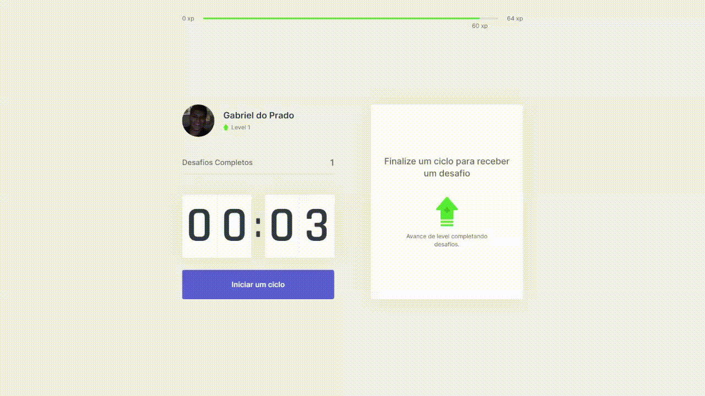

<h1 align="center">
Move.it
</h1>

Move.it help peoples that stay long times on computer. 
With some challenges for you to move your body and eyes.

## Participants

[Gabriel do Prado](https://github.com/praadin)

## Techs

- [x] NextJs
- [x] ReactJs
- [x] Css Modules

## Main Learning

- [x] Context Api
- [x] Server Side Rendering

## Starting Dev Environment

1. Clone this repository. 
2. Run `npm install` or `yarn install`. 
3. Run `yarn start` and acces `http://localhost:3000`. 

## Link to Move.it

[Move.it](https://moveit-nlw99.vercel.app/)
